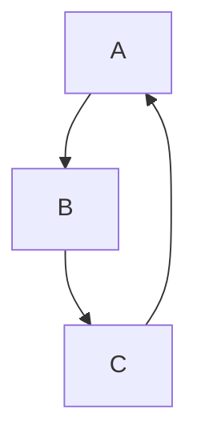

#练习markdown

这就是~~删除线~~(使用波浪号)
这是用来*斜体*
这是用来加粗**加粗**的文本
       这是用来==斜体==的文本（高亮）
水 H~2~o
双氧水 H~2~0~2（下标）
面积 m^2^(上标)
体积 m^3^
:smile: :laughing:

name | price
--- | :--
fried chicken | 19
cola | 5

eyJ2Ijoid2lufDEuMi41IiwiaSI6InM4SjVPVmI3d24iLCJsIjoiTEFQVE9QLTJBTzZBSUo0IHwgODYxODMgfCBXaW5kb3dzIn0=

>"后悔"
>

* 1
* 2
* 3
1. 第一liabi
2. 小胡
3. 看数据仓库

```c++
#include<iostream>
using namespace std;
int main()
{
	cout<<"hello,typora\n";
	return 0;
}
```
[绿叶学习网](http://www.baidu.com/)
<http://www.baidu.com/>

<!--流程图-->

```mermaid

graph LR;
	A-->B
	B-->C
	C-->A
	
	